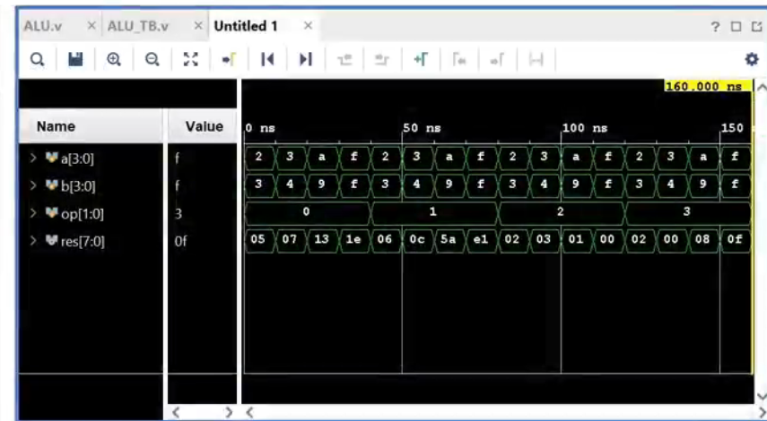

# 4-Bit Arithmetic Logic Unit (ALU)

## 📜 Overview
This project implements a **4-bit Arithmetic Logic Unit (ALU)** in Verilog. An ALU is a combinational logic module that performs arithmetic and logical operations. This ALU supports **four operations**: addition, multiplication, modulus, and bitwise AND. The Verilog implementation includes:
- A fully functional ALU module.
- A testbench to verify its functionality.

---

## ⚙️ Features
- **4-Bit Operands**: Accepts two 4-bit inputs (`A` and `B`).
- **Operation Selector**: A 2-bit input (`op`) to choose one of four operations.
- **8-Bit Output**: The output is 8-bits wide to accommodate the result of multiplication.
- **Supported Operations**:
  - `op = 00`: Addition (`A + B`)
  - `op = 01`: Multiplication (`A * B`)
  - `op = 10`: Modulus (`A % B`)
  - `op = 11`: Bitwise AND (`A & B`)

---

## 🛠️ Implementation

### ALU Module
The ALU is implemented using a **case statement** within an `always` block to handle the operations based on the value of the operation selector (`op`).

## 🧪 Testbench

The testbench verifies the functionality of the ALU for all operations with a set of predefined test cases. It uses (`monitor`) to print the results in the console for easy debugging.

## 🚀 How to Run the Code

### Requirements:
- Vivado or any other Verilog simulation tool.

### Steps:
1. Create a project in the simulation tool.
2. Add the `ALU` module and the testbench files.
3. Run the simulation.
4. Observe the results in the console or waveform viewer.

## Waveform Preview

## 📝 Example Output

The testbench evaluates the following cases:

| `A`  | `B`  | `op` | Operation      | Result |
|------|------|------|----------------|--------|
| 2    | 3    | 00   | `2 + 3`        | 5      |
| 3    | 4    | 01   | `3 * 4`        | 12     |
| 10   | 9    | 10   | `10 % 9`       | 1      |
| 15   | 15   | 11   | `15 & 15`      | 15     |

## 🌟 Key Learnings
- Using Verilog for designing combinational circuits.
- Working with case statements to handle multiple operations.
- Writing effective testbenches for validation.

